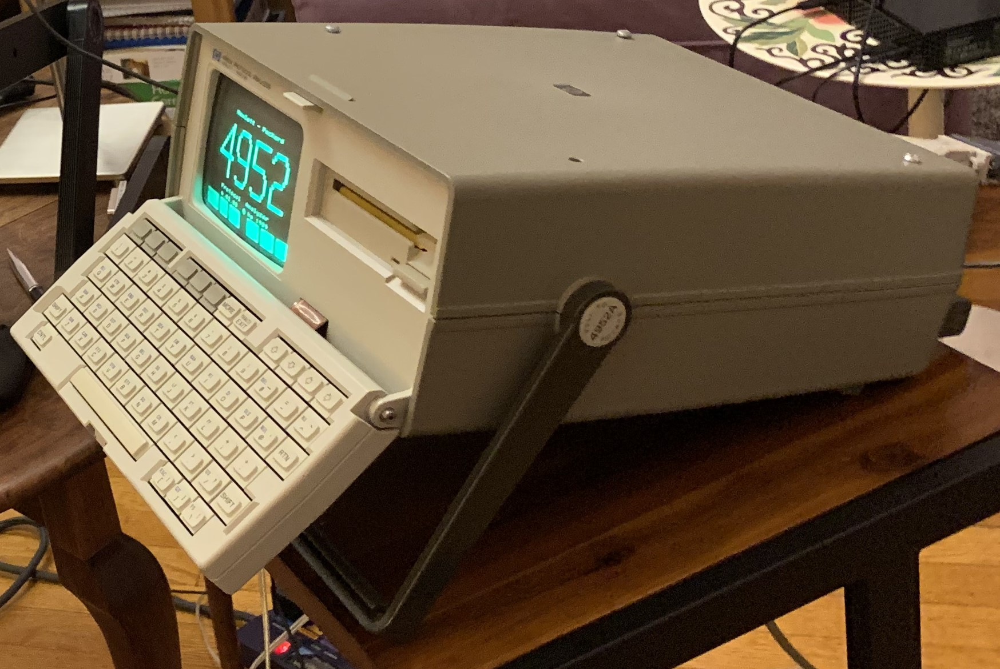

# HP4952A Protocol Analyzer

> The HP 4951C (19.2 kbps) and HP 4952A (64 kbps synchronous, 19.2 kbps asynchronous) are portable protocol analyzers used for troubleshooting during installation, maintenance and design of data communications networks and equipment.

> The HP 4951C and HP 4952A allow you to monitor and decode data transmission, test remote facilities from your location, simulate network components, and perform bit error rate tests. They can also be used as asynchronous terminals. Protocols that can be tested include Async, BSC, SDLC (NRZI), HDLC, X.25, SNA, DDCMP and user-defined protocols. The HP4952A also tests X.21. 

> _(from the [datasheet](https://emeriaud.fr/HP4952A/manuals/HP-4951C-4952A-Datasheet.pdf))_

My goal is to use this cute portable machine as a small RS-232 terminal for a Raspberry Pi ([video](https://www.youtube.com/watch?v=Tq8d_-6dMOw)), and for a SWTPC 6800 microcomputer.  Along the way, I've started to get interested in writing Z80 applications to run on the analyzer too.

This repo includes:

* [Disk images](disks) and copies of applications and menus extracted from them,
* Some documentation of the ["remote control" protocol](remote-protocol), and some Python code that can send commands and upload and download applications and data,
* A new game, "[snek](snek)"

Other things found elsewhere:

## Hardware

* Some nice pictures of the [three main boards](https://aiju.de/misc/hp4952a/pics/) (Z80, 68008, 80C88)
* More pictures [with some analysis](https://hackaday.io/project/163027/logs)

## Software Sources Online

All at the HP Computer Museum:

* [Application Software](http://www.hpmuseum.net/display_item.php?sw=589)
* [Utility and DataComm](http://www.hpmuseum.net/display_item.php?sw=588)
* [Demo Software](http://www.hpmuseum.net/display_item.php?sw=394)

## Documentation Online

* Docs at [HP Computer Museum](http://www.hpmuseum.net/exhibit.php?hwdoc=1123)
* Operating Manual at [Bitsavers](http://www.bitsavers.org/test_equipment/hp/4952/)
* Operating Manual and other docs at [emeriaud.fr](https://emeriaud.fr/HP4952A/manuals/)
* Test Library pdf at [classiccmp.org](http://www.classiccmp.org/cini/systems.htm#HP)
* HP4951C [service manual](http://www.hpmuseum.net/document.php?hwfile=6179)
* KO4BB has [EPROM dumps](http://ftb.ko4bb.com/getsimple/index.php?id=manuals&dir=HP_Agilent) from 4951C and 4957.

## Useful Links

* [Hackaday - David Kuder](https://hackaday.io/project/162448-hacking-the-4952), includes keymap information
* [GitHub - David Kuder](https://github.com/dkgrizzly/4952oss) - Tetris and BASIC sources!
* [Hackaday - Trevor Johansen Aase](https://hackaday.io/project/163027-hp-4952a-turned-general-purpose-cpm-machine), includes a good section on using `dosbox` to run 5XREMOTE
* [Reddit - Trevor Johansen Aase](https://www.reddit.com/r/cpm/comments/aa13nk/turning_an_hp_4952a_protocol_analyzer_into_a_cpm/)
* [Twitter - Mark J. Blair](https://twitter.com/nf6x/status/995778707011731456)