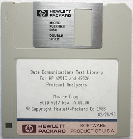

HP 4952A Utility Disc



```
EXTD_ASYNC   ASYNC 14.4K & 38.4k      A.00.00
COPY_DISC    Copy disc & archive utility     
DEMO_DATA    MENUS & DATA FOR GETTING STARTED
TERM         VT100 TERMINAL EMULATOR  A.00.00
IPARS_MEC    IPARS/MOD. ERROR CHECK   A.00.00  
```

[Source](http://www.hpmuseum.net/display_item.php?sw=588)

(c) Copyright Hewlett-Packard Co 1986,89
