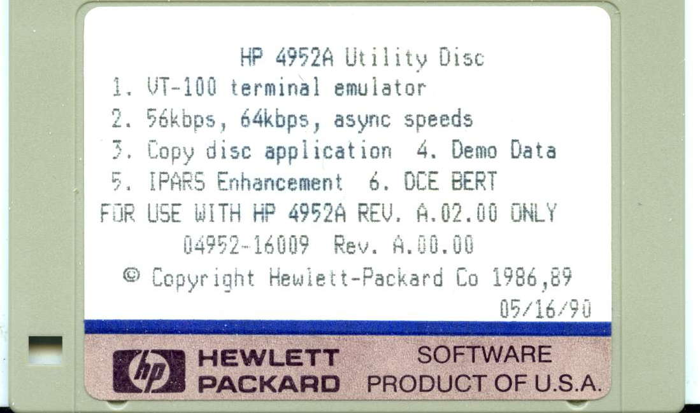

HP 4952A Utility Disc

* [VT100](VT100.APP) - VT100 Async Terminal Emulator
* [ASYNC_56K](ASYNC_56K.APP) - 56K bps asynchronous
* [ASYNC_64K](ASYNC_64K.APP) - 64K bps asynchronous
* [COPY_DISC](COPY_DISC.APP) - Copy disk & archive utility
* [DCE_BERT](DCE_BERT.APP) - DCE Bert Emulator
* [IPARS_MEC](IPARS_MEC.APP) - IPARS & Mod Error Check
* [DEMO_DATA](DEMO_DATA.DAT) - Menus & Data for Getting Started

Extracted from
https://emeriaud.fr/HP4952A/software/
- Convert to RAW using `dskconv`
- extract using `lifdir` and `lifget`

(c) Copyright Hewlett-Packard Co 1986,89