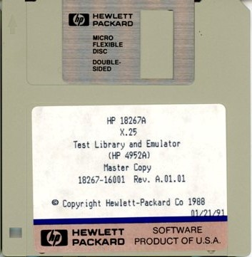

Test Library and Emulator



```
X25_EMULAT   X.25 Level 2 Emulator Rv A.01.01
LEVEL1_MON   Mon Test for Dev Emulating   6/9
DCE_SUBNET   Determine Sub/Net
DCE_FRAME    Determine Max Frame Size    12/9
DCE_LCN1     Automatic LCN Range Test    12/9
DCE_LCN2     Manual LCN Range Test       12/9
DCE_WINDOW   Packet Window Size Test     12/9
DCE_CALL_1   Call
DCE_CALL_M   Call
DCE_FACIL    Reverse Charge
DTE_SUBNET   Determine Sub/Net
DTE_FRAME    Determine Max Frame Size    12/9
DTE_LCN1     Automatic LCN Range Test    12/9
DTE_LCN2     Manual LCN Range Test       12/9
DTE_WINDOW   Packet Window Size Test     12/9
DTE_CALL_1   Call
DTE_CALL_M   Call
DTE_FACIL    Reverse Charge
MON_TEST     Final Monitor Test          12/9
```

[Source](http://www.hpmuseum.net/display_item.php?sw=589)

(c) Copyright Hewlett-Packard Co 1986,89
