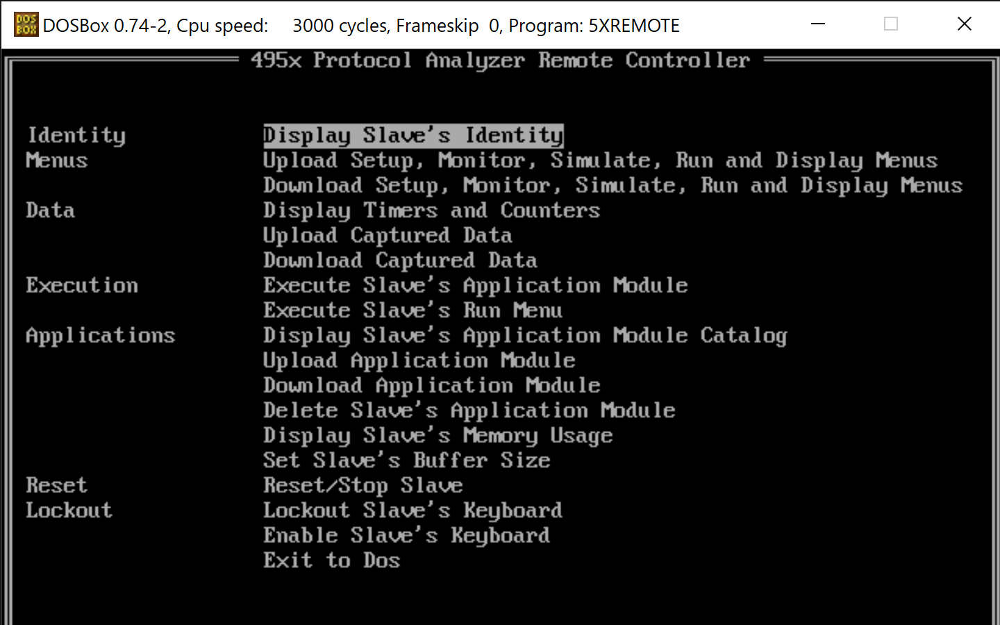

# Remote protocol

The 'Remote/Printer' serial port on the analyzer can be used to connect to a remote controller or remote analyzer; or to a printer.

## Utilities Disk

The [PC Utilities Disk 1](http://www.hpmuseum.net/display_item.php?sw=597) includes a few DOS applications that can be used to work with menu-files, event(?) files, and disks.  The `5XREMOTE.EXE` application is a remote control application that can operate the 4952A remotely.

[Here](https://hackaday.io/project/163027-hp-4952a-turned-general-purpose-cpm-machine/log/158754-getting-programs-to-your-4952) is a short writeup of how to do that.

As an alternative to 5XREMOTE, you can use the [comms script](comms) - see [the end of this page](#try-it).


Remote functions include:
* Get the remote device's ID.
* Reset the analyzer.
* Upload an application (from the analyzer to the PC).
* Download an application (from the PC to the analyzer).
* Upload and download custom menus.
* Display timers and counters.
* Upload and download captured data.
* Run applications on the analyzer.



## The Remote Protocol

Using [interceptty](https://github.com/geoffmeyers/interceptty) I've captured a few of the commands.

Each message (request and response) follows a pattern:
```
Msg Hdr:        0x96 0x96 0x96 0x96
Cmd Hdr:        0x81 0x04 0xc0 0x00 0x00 0x00
CRC-16:         0xd3 0xd1
Cmd Data:       0x49 0x44 0x52 0x45
CRC-16:         0xaa 0xda
```

* `Msg Hdr` is 4 bytes 0x96
* `Cmd Hdr` is 6 bytes,
    - 81 xx aa bb cc dd: packet with data area
        * xx = length of the data area to follow (0 means 256 bytes)
        * aa = continuation code
        * bb = sequence number?
        * cc, dd spare?
    - 05 zz aa bb cc dd: packet with no data area
        * zz = 01: success, 02: failure
        * aa = continuation code
        * bb = sequence number
        * cc, dd spare?
    - the example above shows: 4 bytes of data to follow, no continuation packet expected
* Then a CRC-16 checksum of the `Cmd Hdr`
* `Cmd Data` is binary or ASCII ("IDRE" in this example, which is the command "identify remote")
* Then a CRC-16 checksum of the `Cmd Data`.

## Remote Commands

Observing the log data and using `strings` on 5XREMOTE shows these commands below.  ("Upload" and "Download" are from the perspective of the analyzer).  I assume that one analyzer can control another using the same protocol.

| code | name | description |
| --- | --- | --- |
| CKDR | ? ||
| DEAP | Delete Application Module | This function will delete an application program from the remote protocol analyzer's application memory.  On the HP4953A and HP4954A you must enter the application file name and group name. |
| ENKB | Enable Remote Keyboard | This function will unlock the keyboard so an operator may use the remote protocol analyzer. |
| EXAP | Execute Application | This function will execute a currently loaded application program on the remote protocol analyzer.  You will be prompted for a group string and file name.  In most cases, the group string can be left blank.  For the HP4951C and the HP4952A, both the group string and the file name may be left blank. |
| EXRU | Execute Run Menu | This function will remotely execute the current run menus.  These include the setup, data, monitor, simulate, run, and display menus.  Use the Reset Slave command (not available on an HP4951C) to halt execution. |
| IDRE | Display Identity | This function will identify the remote instrument by model number.  It can be used as a simple function to verify cable connections, baud rates, and remote addresses. |
| LOKB | Lock Remote Keyboard | This function will lock the instrument's keyboard.  This operation is required on most remote operations on a HP4953A or HP4954A. |
| RCAH | Download Application Header (?) | _Before downloading an application, this sends the application header (description text)._ |
| RCAL | Download Setup, Monitor, Simulate, Run and Display Menus | This function will download a menu file that was previously uploaded into a DOS file.  The menus downloaded are the setup, monitor, simulate, run and display menus.  You can use this to configure the protocol analyzer.  To find out more information about menu compatibility between different model protocol analyzers please refer to the operating note. |
| RCAP | Download Application Module | This function will download an application program that is stored in a DOS file to the remote instrument.  Remember that application programs are not compatible between different protocol analyzers. |
| RCCD | Download Captured Data | This function will download buffer data from a DOS file the remote protocol analyzer's capture buffer.  You can then view the data in the examine data menu of the protocol analyzer's capture buffer. |
| RSRE | Reset Remote | This function will reset the remote instrument, or stop the execution of a menu or application.  If stopping a menu or application, issue the function again to put the instrument in its top level menu. (Not valid on an HP4951C) |
| SEAP | Set Application Name ||
| SEBL | Set Application Header (?) | _When downloading an application, this command is a "block header" that includes a counter for the block being downloaded, and a flag indicating whether it's finished._ |
| SEBS | Set Buffer Size | This function will change the allocation of memory set aside for application programs versus the data capture buffer.  This operation is valid only for the HP4953A and HP4954A.  You may set the data capture buffer size in 8KB increments from 16KB to 256KB.  The tradeoff is that memory available for other functions decreases by a proportional amount. |
| TRAD | Display Application Module Catalog | This function will upload the remote instrument's application module catalog. This will help you determine which applications are resident on the remote instrument. |
| TRAH | Upload Application Header (?) | |
| TRAL | Upload Setup, Monitor, Simulate, Run and Display Menus | This function will upload the remote instrument's setup, monitor, simulate, run and display menus to a DOS file. You will be prompted for a file name. |
| TRAP | Upload Application Module | This function will upload an application program, saving it to a file.  You will be prompted for a DOS file name, and then a group string and instrument file name.  On the HP4953A and HP4954A these names are displayed in the Application Module Catalog.  The HP4951C and HP4952A can only have one resident application, therefore these names can be left blank. |
| TRBR | Display Memory Usage | This function will obtain information about the remote protocol analyzer's memory statistics.  This information will include the capture buffer size, the amount of data in the capture buffer, how much memory application programs are using, and the amount of available space left for more application programs. |
| TRCD | Upload Captured Data | This function will upload buffer data from the remote protocol analyzer into a DOS file.  You will be prompted for start and ending block numbers, and a file name.  This function tries to get the instrument's current block limits by first uploading memory statistics.  If you get the 'link error' message, please check the instrument's connections and baud rates, and correct the problem before proceeding. |
| TRRS | ? ||
| TRTC | Display Timers and Counters | This function will upload the remote instrument's timer and counter values. There are five counters and five timers. |

## Try it!

This [small python application](comms) an send applications to the analyzer.

Requires python 3.7 or later,
```
python3 -m pip install -r requirements.txt
```

To run it:
```
$ ./comms /dev/ttyUSB0 9600 --ident
HP4952

$ ./comms /dev/ttyUSB0 9600 --reset

$ ./comms /dev/ttyUSB0 9600 ~/snek/snek.app
HP4952
App Block 0
App Block 1
ACC
```

