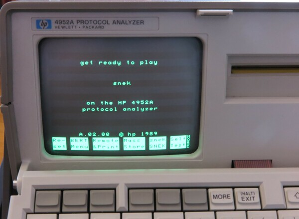

# snek

This is a version of the classic "snake" game, for the HP4952A protocol analyzer.

## Loading the Game

You can copy the [snek.app](snek.app) file onto a HP-LIF-formatted floppy disk, and then load it directly.  Alternatively, use 5XREMOTE.EXE or my `comms` utility to load over the "remote/printer" serial port, following [these steps](../remote-protocol/README.md).

## How to Play

Controls are:
* First function key: turn left
* Second function key: turn right
* MORE key: speed up
* Up/Down/Left/Right keys: turn to the corresponding direction
* EXIT: exit the game.

Eat the charms to increase your score.  Don't crash into anything!

## Other notes

This is my first time writing Z80 assembly language in a very long time.  Thanks to David Kuder for his [libraries](https://github.com/dkgrizzly/4952oss), which make all this possible.

I think the game is playable.  Let me know any bugs you find, and any features you want!

